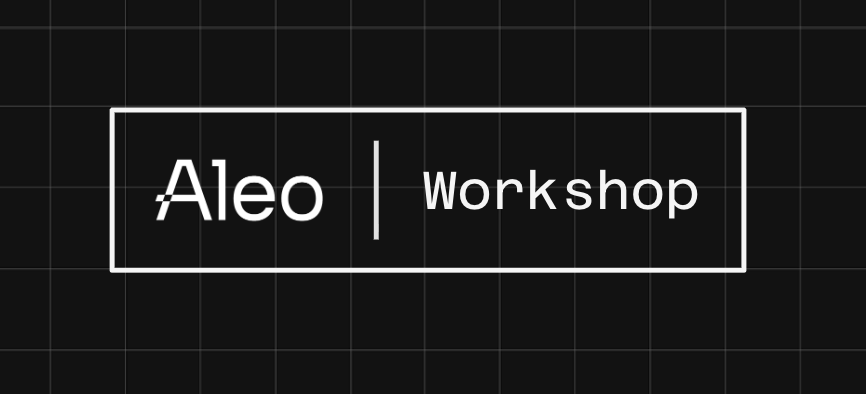

# Compliant Private Tokens Workshop

This is a workshop for building compliant and privacy-preserving tokens on the Aleo blockchain.  

# Goal and Takeaways

By the end of the workshop, developers should learn:
- Why Aleo is uniquely positioned to enable compliant private payments and transactions

- How to create a basic token in Leo

- How to implement public/private `transfer` and `mint` functions for that token


# Getting Started

### Leo Playground
If you're new to developing or just want to try out the Leo language, check out the **[Leo Playground](https://play.leo-lang.org)**. It's a web-based IDE that's designed to allow developers to build, deploy, and execute programs, all in the browser!  It comes with an editor, Github integrations, and a number of utilities to manage programs and interface with the network.

You can load the project directly into the Leo Playground by navigating into the `private-token-workshop-token-template/` submodule and loading that repo using the Git feature of the playground.

<!-- ### VSCode / Sublime Text / IntelliJ
For more experienced developers, the Leo team also maintains plugins for a number of different editors.  For specifics on how to install for your favorite editor, check out the **[Dev Env](https://docs.leo-lang.org/getting_started/ide)** guide for more information

You'll also need to have the Leo CLI (and Rust) installed locally.  Check out the **[Installation](https://play.leo-lang.org)** guide for more information. -->


### Creating an Account
Head over to the command line section of the Leo Playground and run the following command:
```
leo account new
```
This will generate a new Aleo account with the corresponding private key, view key, and address.  The output should appear something like this:

```
  Private Key  APrivateKey1zkp...
     View Key  AViewKey1..
      Address  aleo1...
```
Keep track of all of these, as you'll need them later.

### Funding Your Account

#### Testnet Faucet
You'll need some Testnet tokens to deploy  and interact with programs onchain.  Head over to INSERT_LINK_HERE and provide the address you just generated to acquire some.

#### `.env` File
Once you've funded your account, return back to the Leo Playground with the project loaded in and open the `.env` file.  This file is where you can specify the network and endpoint to broadcast to, as well as the private key to sign transactions with. Fill in the `PRIVATE_KEY` field with the private key you just generated.


### Additional Resources:
- [Aleo Developer Docs](https://developer.aleo.org) 

- [Leo Docs](https://docs.leo-lang.org)

- [Aleo Discord](https://discord.gg/aleo)


# Repository Overview
### `private-token-workshop-token-template/`
This is the Leo project where you will be doing all of your coding. Some basic features have been included, including a `record` type for private balances and a `mapping` to keep track of public balances

In addition, the function signatures/headers have already been provided for you, as well as a list of features you will need to fill in for each function.


<!-- Finally, a set of test cases has been written for you to check your work.  Simply run `leo test` from the command line while in the project directory. -->


### `ofac_check_demo/`
The `ofac_check_demo.aleo` program is designed to mimic an onchain compliance check. It contains a simple `mapping` of mock "OFAC-sanctioned addresses" and a `transition` function to validate addresses against that mapping.  

This program is already deployed on Testnet, and is added as a remote network dependency in the `private-token-workshop-token-template` Leo project.  It is here purely for reference. You should **NOT** need to  edit/use anything in `ofac_check_demo/` or edit your `private-token-workshop-token-template/` dependencies.


# Build

First, we're going to build a token program in Leo by filling in the provided template code.  The program will include:
- `mint_public` & `mint_private` functions

- `transfer_public` & `transfer_private` functions
- Compliance checks against the `sanctioned` mapping in `ofac_check_demo.aleo`

## Task 0: Name Your Token
Choose what your token program will be named!  This should be longer than 10 characters to avoid additional network fees.  It should also not conflict with any existing program on the network.

Once you've decided on a name, change the name of the program at the top of `main.leo`.  Additionally, change the "program" field in the `program.json` file to match the name of your new program.  These two fields **MUST** match or your program will not compile correctly.

## Task 1: Mint (Public)
This feature mints new tokens by updating the public mapping value for the recipient.  In line with Aleo's `async` model, it is split into two separate functions:

### `mint_public()` 
This is an `async transition` that is executed offchain and has its corresponding zero-knowledge proof verified onchain.  
1. First, you should call the `address_check()` function from `ofac_check_demo.aleo`.  This has already been done for you in the template.

2. You should then pass the returned `Future` to the `mint_public_onchain` function alongside the other appropriate fields.

### `mint_public_onchain()` 
This is an `async function` that is executed onchain.  
1. First, await the `address_check : Future`.  This has already been done for you in the template.

2. Set the value for `recipient` in the `balances` mapping to the current value plus `amount` .

## Task 2: Mint (Private)
This feature mints new tokens by initializing a new private record with the specified amount of tokens for the recipient. In line with Aleo's `async` model, it is split into two separate functions:
    
### `mint_private`:
This is an `async transition` that is executed offchain and has its corresponding zero-knowledge proof verified onchain.  
1. First, you should call the `address_check()` function from `ofac_check_demo.aleo`.  

2. Next, initialize a `Token` record with the `recipient` as the owner and the `amount` as the amount.

3. Return the `Token` record and pass the `Future` to the `mint_private_onchain` function.

### `mint_private_onchain`:
This is an `async function` that is executed onchain.    
1. Await the `address_check : Future`

## Task 3: Transfer (Public)

This feature publicly transfers tokens between two users by deducting the transfer amount from the sender's balance
in the public mapping and adding the same value to the recipient's balance
    
### `transfer_public`:
This is an `async transition` that is executed offchain and has its corresponding zero-knowledge proof verified onchain.  
1. First, you should call the `address_check()` function from `ofac_check_demo.aleo`.  

2. You should then pass the returned `Future` to the `transfer_public_onchain` function alongside the other appropriate fields.
    - For the `sender` field, you can use `self.signer` to specify the address that initialized the function call

### `transfer_public_onchain`:
This is an `async function` that is executed onchain.
1. First, await the `address_check : Future`.

2. Next, set the value for `sender` in the `balances` mapping to the sender's current value minus `amount` 

3. Finally, set the value for `recipient` in the `balances` mapping to the recipient's current value plus `amount` 


## Task 4: Transfer (Private)


This feature privately transfers tokens between two users by consuming the sender's `Token` record and producing two 
new `Token` records.  The first is owned by the recipient with the amount sent, and the second is owned by the sender with any leftover amount.

### `transfer_private`:
This is an `async transition` that is executed offchain and has its corresponding zero-knowledge proof verified onchain.  
1. First, you should call the `address_check()` function from `ofac_check_demo.aleo`.

2. Next, initialize a `Token` record with the `recipient` as the owner and the `amount` as the amount

3. Initialize another `Token` record with the `sender` as the owner and the remaining balance as the amount

4. Return both `Token` records and pass the `Future` to the `mint_private_onchain` function

### `transfer_private_onchain`:
This is an `async function` that is executed onchain.
1. Await the `address_check : Future`.
    


# Deploy and Interact Onchain
Now that you've built and tested your program, you're ready to deploy your program to Testnet.  This is where you'll need the Testnet credits mentioned earlier.

After deploying, you should now be able to interact with your deployed program onchain.
1. Publicly mint 100 tokens to your address

2. Publicly transfer those tokens to `<WORKSHOP_ADDRESS>`
   
3. Privately mint an additional 100 tokens to your address
   
4. Privately transfer those tokens to `<WORKSHOP_ADDRESS>`

